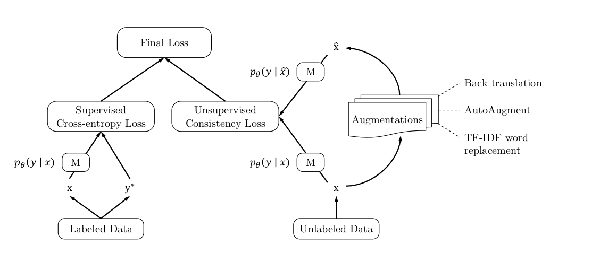

# Sentiment-Analysis-for-Customer-Feedback

Unsupervised Data Augmentation (UDA) :
Deep learning or machine learning requires lot of labeled data for the better performance. Labeling data is one of the costly process and making use of unlabeled data is an important direction to address this costly process. The main idea of Unsupervised Data Augmentation which is shortly called as UDA is to make use of unlabeled data. In UDA, data augmentation plays an important role and there are different techniques used to implement data augmentation which is been discussed below. On other hand UDA uses state of the art data augmentation methods on unsupervised data which is available at larger quantities and it has a high potential to work much better than supervised data augmentation.

The architectural design of unsupervised data augmentation is as follows

Topic modeling:

Topic Modeling is a process which automatically identify topics present in a text object and also it derives hidden patterns exhibited by a text corpus. Topic Model is very useful for multiple purposes which includes:

●	Document clustering

●	Organizing large blocks of textual data

●	Information retrieval from unstructured text

●	Feature selection

 The below image illustrates how topic model works:

In our case, instead of text documents, we have thousands of online product reviews for the items.Our aim is to extract a certain groups of important words from the reviews. These group of words are basically the topics which would help in ascertaining what the consumers are actually talking about in the reviews.

# Workflow

